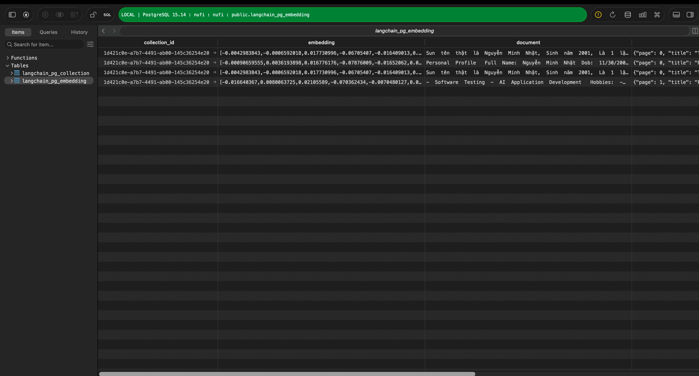

# RAG (Retrieval-Augmented Generation)

How document chat works in Nufi Chat. RAG lets users upload documents and have the
model answer grounded in their content, instead of relying only on the model's
built-in knowledge.

## Architecture

| Component | Role |
|---|---|
| Nufi Chat | Orchestrates upload, embedding, retrieval, and chat |
| Retrieval service | Chunks documents, calls the embedder, stores/searches vectors |
| Vector database | Stores document chunks and their embedding vectors |

Embeddings are produced by **Google Gemini** (`gemini-embedding-001`). The chat
answer itself is produced by the **Nufi model**. Gemini is used *only* for
embeddings.

> **Note:** RAG is part of the **Agents / File Search** feature. A document is
> embedded only when uploaded into an Agent's Knowledge. Files attached directly to
> a normal chat message are read as that conversation's context only — they are not
> stored for retrieval.

## Sequence

```mermaid
sequenceDiagram
    autonumber
    actor User
    participant Chat as Nufi Chat
    participant RAG as Retrieval service<br/>(File Search)
    participant Gemini as Google AI Studio<br/>(gemini-embedding-001)
    participant PG as Vector database
    participant LLM as Nufi model

    rect rgb(20,40,60)
    note over User,PG: Phase 1 — Ingestion (upload doc to an Agent's Knowledge / File Search)
    User->>Chat: Upload document to agent (File Search)
    Chat->>Chat: Parse & chunk text
    Chat->>RAG: Embed request (chunks)
    RAG->>Gemini: Generate embeddings (chunks → vectors)
    Gemini-->>RAG: Embedding vectors
    RAG->>PG: Store chunks + vectors
    PG-->>RAG: ok
    RAG-->>Chat: Embedded
    Chat-->>User: File ready (stored in agent knowledge)
    end

    rect rgb(20,55,40)
    note over User,LLM: Phase 2 — Retrieval (chat with the same agent)
    User->>Chat: Ask a question (agent w/ File Search selected)
    Chat->>Gemini: Embed the question
    Gemini-->>Chat: Query vector
    Chat->>RAG: Query (query vector)
    RAG->>PG: Vector similarity search (top-k)
    PG-->>RAG: Most relevant chunks
    RAG-->>Chat: Matching chunks + metadata
    Chat->>Chat: Build prompt = question + retrieved chunks
    Chat->>LLM: Chat completion (augmented prompt)
    LLM-->>Chat: Answer grounded in the doc
    Chat-->>User: Grounded answer
    end
```

Notes:
- **Phase 1** runs once per uploaded document. **Phase 2** runs on every question.
  Because the document lives in the agent's Knowledge, retrieval works across **new
  sessions** too — as long as the same agent is selected.
- Gemini produces only the embeddings; the final answer is generated by the Nufi
  model.

## End-user flow

1. Switch the endpoint to **Agents**.
2. Create an agent backed by the **Nufi** model.
3. Enable **File Search** on the agent.
4. Upload documents into the agent's **Knowledge** (in the agent editor — not as a
   per-message attachment, which is conversation-scoped).
5. Chat with that agent; answers are grounded in the uploaded documents.

## Data storage

Each uploaded document is split into chunks. Every chunk is stored as one row in the
vector database, together with the embedding vector that represents its meaning.

Two tables hold the data:

| Table | Contents |
|---|---|
| `langchain_pg_collection` | One collection per source (file / agent knowledge) |
| `langchain_pg_embedding` | One row per chunk |

Key columns in `langchain_pg_embedding`:

| Column | Meaning |
|---|---|
| `collection_id` | Which collection (source) the chunk belongs to |
| `embedding` | The chunk's embedding vector (used for similarity search) |
| `document` | The original chunk text |
| `cmetadata` | Source metadata, e.g. `{ "page": 0, "title": ... }` |

At query time, the question is embedded into the same vector space and compared against
the `embedding` column to find the most similar chunks; their `document` text is what
gets injected into the prompt as context.
